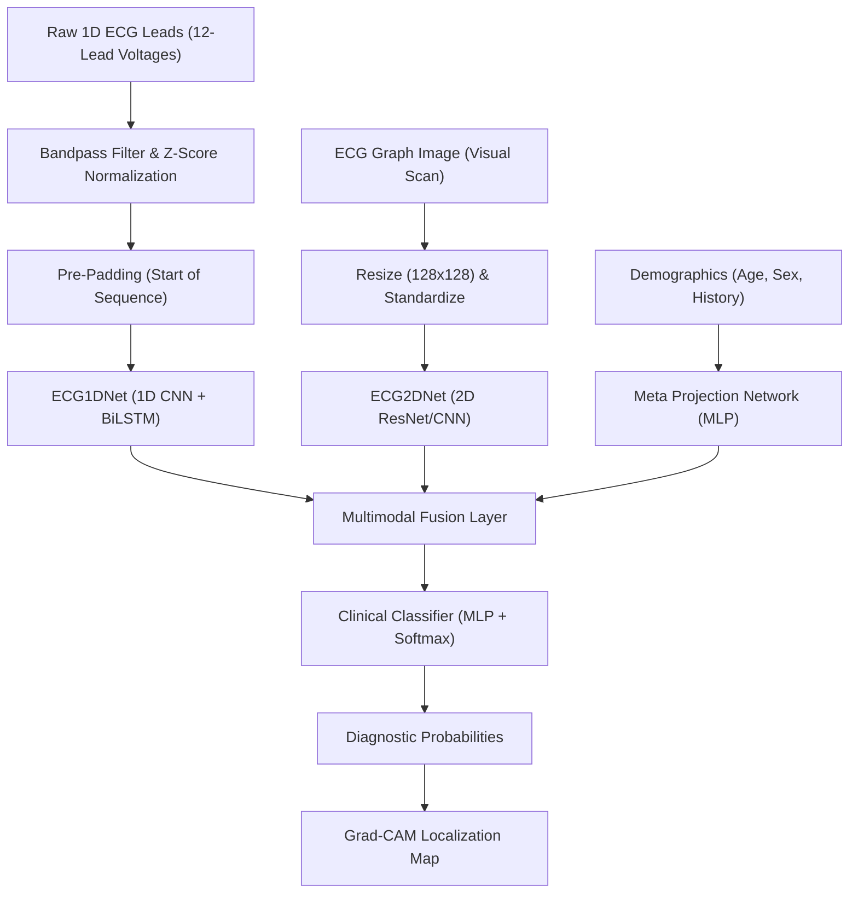

<!-- Header Banner -->

 

<!-- Custom Typing SVG -->

 

<!-- Premium Contact & Social Badges -->

  
  
  

Based in India • Architecting the Future with Intelligence & Code

---

### 🧠 Core Philosophy & Engineering Focus
I design high-performance predictive systems, custom deep learning architectures, and scalable MLOps pipelines. I believe in **generalization over memorization**—building models that learn actual semantic meaning, handle edge-case noise, and maintain mathematical integrity under production traffic.

*   **Deep Learning Invariants:** Implementing rigorous neural sequence techniques (e.g., pre-padding for RNNs/LSTMs to preserve signals, SpatialDropout for regularizing CNNs).
*   **Multimodal Fusion:** Fusing unstructured signals (1D signals, 2D scans) with structured metadata.
*   **Edge Optimization:** Compiling and quantizing models (INT8/FP16) for low-power edge nodes.

---

### 🩺 Flagship Project: CardioGuard
> **Multimodal Clinical ECG & Heart Rhythm Analyzer**

CardioGuard is a production-grade deep learning framework that integrates 1D ECG lead sequential signals, 2D visual scans, and patient clinical metadata using a **Multimodal Fusion Network** to deliver state-of-the-art diagnostic accuracy, backed by explainable Grad-CAM heatmaps.

#### Key Architecture & MLOps Specs:
*   **ECG1DNet:** 1D Conv layers + BiLSTM utilizing **pre-padding sequence invariants** to prevent zero-padding from diluting the final hidden state classification signal.
*   **ECG2DNet:** Custom ResNet capturing anomalies from plotted visual scans, regularized using 2D Spatial Dropout (`0.3`).
*   **Explainability Gateway:** FastAPI backend that streams classification results paired with localized Grad-CAM anomaly intervals.

---

### 🚀 Highlighted Systems

#### 🛰️ ModelRoute-V2: Multi-Agent LLM Routing Engine
*   **Description:** An intelligent local router that classifies prompt complexity to dynamically direct queries. Low-complexity prompts run on local quantized models (Llama-3-8B), while high-complexity prompts route to commercial APIs, optimizing cloud resources.
*   **Results:** **64.2% API Cost Reduction** | **4.2ms Routing Latency** | **85M+ Tokens Optimized**
*   **Tech Stack:** `PyTorch`, `Transformers`, `FastAPI`, `Docker`, `Llama-3`, `BERT`

#### 🧬 DataSynth-LLM: Tabular Data Synthesizer
*   **Description:** A GAN-based pipeline combined with an LLM agent feedback loop that synthesizes realistic, HIPAA-compliant tabular medical datasets. The GAN models the distribution while the LLM acts as an expert validator checking clinical coherence.
*   **Results:** **98.7% Correlation Match** | **100.0% HIPAA Privacy Score** | **250 Epochs training cycles**
*   **Tech Stack:** `CTGAN`, `Python`, `Llama-3-Agent`, `Pandas`, `SciPy`, `W&B`

#### 👁️ VisionFlow: Edge Multi-Object Tracker
*   **Description:** A computer vision pipeline deploying YOLOv8 and ByteTrack on low-power devices. Optimized via post-training static quantization (INT8) to achieve high frame rates.
*   **Results:** **45.0 FPS on Raspberry Pi 4** | **91.2% MOTA Tracking Accuracy**
*   **Tech Stack:** `YOLOv8`, `OpenCV`, `TensorRT`, `C++`, `Docker`, `ONNX`

---

### 🛠️ Tech Stack & Arsenal

| Domain | Technologies |
| :--- | :--- |
| **Artificial Intelligence & DS** | `Python` `PyTorch` `TensorFlow` `Scikit-Learn` `Pandas` `NumPy` `Matplotlib` `Jupyter` |
| **Frontend & Mobile Dev** | `TypeScript` `JavaScript` `React` `Next.js` `TailwindCSS` `Expo` `Redux` `HTML/CSS` |
| **Backend & Cloud** | `Node.js` `Express` `MongoDB` `Firebase` `Supabase` `FastAPI` `PostgreSQL` |
| **DevOps & Tooling** | `Git` `GitHub` `Docker` `Linux` `AWS` `Vercel` `Weights & Biases (W&B)` |

---

### 📈 GitHub Analytics & Status

  
  
    
  
  

 

  

---

### 💡 Developer Quote

 

### ☕ Fuel the Journey
If you like my systems or open-source research, consider supporting my coding sprints!
  

